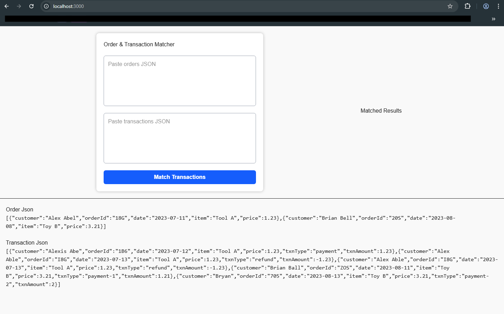
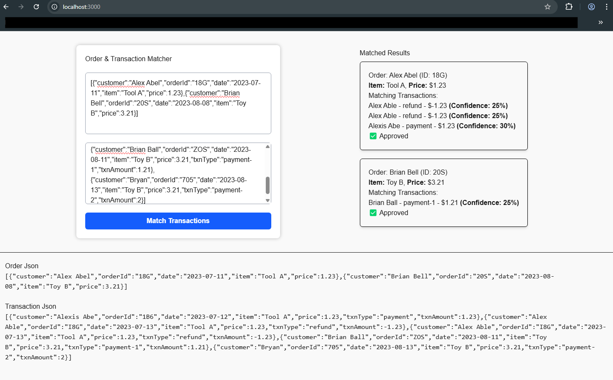

## **Project Summary**  

This project focuses on building a transaction-matching system and integrating it into a web application. It consists of three key phases:  

### **🔹 Part 1: Transaction Matching Algorithm**  

Developed a function to intelligently match transactions with their most likely corresponding orders while handling missing or incorrect data efficiently.  

- Utilized **Fuse.js**, a powerful fuzzy-search library, to improve match accuracy and handle partial or inconsistent data and show the confidence percentage.
- Since perfect accuracy isn't always possible due to unknown error margins, the function prioritizes **the closest possible matches** using weighted scoring.  
- The function processes an array of orders and transactions and returns an object containing the matched results.  
 

### **🔹 Part 2: Web Application Deployment**  
Packaged the matching functionality into a full-stack web application that allows users to input transaction data and receive matched results.  
- Built a **React + Tailwind CSS** frontend for a seamless user experience.  
- Developed a **Node.js + Express** backend to process the matching logic.  
- Users can submit lists of orders and transactions to see results dynamically.  

### **🔹 Part 3: Feature Extension & UX Enhancement**  
Enhanced the application with additional functionality to improve user interaction and match verification:  
  - Designed a UI for users to **approve or reject** transaction matches.  
  - Implemented a **confidence percentage** to help users assess match accuracy and make informed decisions. Users can review each match and approve it accordingly.


## Getting Started

This project consists of two applications:

Frontend Application – Built with React and Tailwind CSS.

Backend Application – Built with Node.js and Express.

## Front End Application 
Navigate to the frontend directory and install the required packages:


```bash
cd frontend_app

npm install
```
Start the Development Server

Run the following command to start the React development server:

```bash
npm run dev
# or
yarn dev
```

## Back End Application

install dependancies 

Navigate to the backend directory and install the necessary dependencies:

Run the backend server using:

```bash
cd match-transactions

npm install

npm run start
```
The Applciation will be available at:

 http://localhost:3000/


Application preview


For reference, I have added a **temporary JSON** at the bottom of the application. There are two JSON datasets:  
1. **Order JSON**  
2. **Transaction JSON**  

Alternatively, you can paste any custom JSON into the text area and click the **"Match Transaction"** button. The matching results will be displayed on the right-hand side.  

### **Result Page Details:**  
- Each result card includes a **confidence percentage** and **matching criteria**.  
- Users can **approve** or **deny** the match.  
- **Note:** The approve/deny actions are currently UI-based and do not trigger any API requests.


## Sample Data 1
```
Order JSON
[{"customer":"Alex Abel","orderId":"18G","date":"2023-07-11","item":"Tool A","price":1.23},{"customer":"Brian Bell","orderId":"20S","date":"2023-08-08","item":"Toy B","price":3.21}]

Transaction JSON
[{"customer":"Alexis Abe","orderId":"1B6","date":"2023-07-12","item":"Tool A","price":1.23,"txnType":"payment","txnAmount":1.23},{"customer":"Alex Able","orderId":"I8G","date":"2023-07-13","item":"Tool A","price":1.23,"txnType":"refund","txnAmount":-1.23},{"customer":"Alex Able","orderId":"I8G","date":"2023-07-13","item":"Tool A","price":1.23,"txnType":"refund","txnAmount":-1.23},{"customer":"Brian Ball","orderId":"ZOS","date":"2023-08-11","item":"Toy B","price":3.21,"txnType":"payment-1","txnAmount":1.21},{"customer":"Bryan","orderId":"705","date":"2023-08-13","item":"Toy B","price":3.21,"txnType":"payment-2","txnAmount":2}]
```
## Sample Data 2
```
Order Json
[{"customer": "Alice Adams", "orderId": "99X", "date": "2023-06-15", "item": "Gadget X", "price": 10.50},{"customer": "Bob Baker", "orderId": "45T", "date": "2023-07-20", "item": "Gizmo Y", "price": 5.75},{"customer": "Charlie Chap", "orderId": "77M", "date": "2023-08-05", "item": "Widget Z", "price": 8.99}]


Transaction JSON
[{"customer": "Alicia Adam", "orderId": "9X9", "date": "2023-06-16", "item": "Gadget X", "price": 10.50, "txnType": "payment", "txnAmount": 10.50},{"customer": "Bobbie B.", "orderId": "4T5", "date": "2023-07-19", "item": "Gizmo Y", "price": 5.75, "txnType": "refund", "txnAmount": -5.75},{"customer": "Charlie Chap", "orderId": "77M", "date": "2023-08-05", "item": "Widget Z", "price": 8.99, "txnType": "payment", "txnAmount": 8.99},{"customer": "Chris Chapman", "orderId": "770M", "date": "2023-08-07", "item": "Widget Z", "price": 8.99, "txnType": "refund", "txnAmount": -8.99},{"customer": "Alice Adams", "orderId": "99X", "date": "2023-06-15", "item": "Gadget X", "price": 10.50, "txnType": "payment", "txnAmount": 10.50}]

```

## Further Enhancements

### Option 1: Learning from User Decisions to Improve Accuracy
Currently, when a user approves or rejects a match, that decision isn’t remembered for future transactions. By allowing the system to learn from past approvals and rejections, we can make smarter and more accurate matches over time.

### How It Works
- Remember User Decisions – Store approvals and rejections in a database or a local file.
- Adjust Confidence Scores 
 If a match was previously approved, similar future matches will get a higher confidence score.
 If a match was previously rejected, similar future matches will be less likely to be suggested.
- Predict Better Matches – Over time, the system will recognize patterns in user behavior and make smarter recommendations automatically.


### Option 2: Scaling to Handle 100K–1M Orders

Note: I haven't implemented Option 2 yet, but here are my suggestions for improvements.
Our current system is designed for small datasets. If we scale to 100K–1M orders, we need to optimize performance.

1. Move to a Database (PostgreSQL/MongoDB)
2. Optimize Matching Algorithm: we'll use indexes and batch processing.
```
const matchOrdersWithTransactions = async (orders) => {
  const batchSize = 1000;
  const results = [];

  for (let i = 0; i < orders.length; i += batchSize) {
    const batchOrders = orders.slice(i, i + batchSize);
    const batchResults = await matchBatch(batchOrders);
    results.push(...batchResults);
  }

  return results;
};
```
       

3. Use Fuzzy Matching Efficiently: Instead of searching all transactions, use pre-filtering:
```
const getPotentialMatches = async (customerName) => {
  return db.query(`
    SELECT * FROM transactions
    WHERE customer_name % $1 LIMIT 50
  `, [customerName]);
};
```
